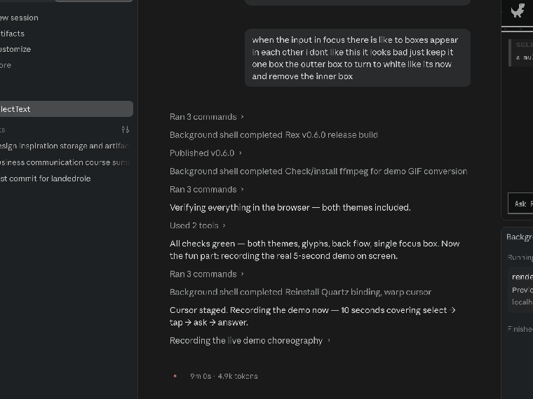

<p align="center"></p>
<h1 align="center">Rex 🦖</h1>
<p align="center"><b>Select text anywhere. Tap <code>Ctrl</code>. Ask.</b></p>

<p align="center"></p>

Rex is a tiny open-source desktop app. Select text in **any** app, tap `Ctrl`, and ask AI about it — the answer streams into a small pixel popup while a dinosaur runs across the top. Your own API key, straight to your provider. No server, no account, no telemetry.

## Install

**[⬇ Download the latest release](https://github.com/MoustafaTech/rex/releases/latest)**

| OS | File | First run |
|---|---|---|
| macOS | `Rex-…-mac-arm64.dmg` (Apple Silicon) / `mac-x64.dmg` (Intel) | Right-click → **Open** (unsigned), grant **Accessibility** when asked, relaunch |
| Windows | `Rex-…-win-x64.exe` | SmartScreen → **More info → Run anyway** |
| Linux | `Rex-…-linux-x86_64.AppImage` / `-amd64.deb` | X11: `sudo apt install xclip xdotool` |

Rex lives in your **menu bar / system tray**: click it → **Settings** → paste an API key from **Anthropic**, **OpenAI**, **Google**, or any **OpenAI-compatible** endpoint (Ollama, Groq, OpenRouter…) and set a model. Done.

## Use

1. **Select text** anywhere → **tap `Ctrl`** (on its own — `Ctrl+C` etc. never trigger it).
2. **Ask.** Answers come back short and summarized; follow up in the same chat.
3. **Add more context**: while Rex is open, select other text and tap `Ctrl` again — it joins the same conversation, memory intact.
4. `Esc` closes. Drag any edge to resize. Light/dark theme follows your system (or pick one in Settings).

## Run from source

```bash
git clone https://github.com/MoustafaTech/rex.git
cd rex && npm install && npm start     # Node 20+, nothing else
```

`REX_DEBUG=1 npm start` prints trigger/capture logs. `npm run dist` builds installers for your OS.

## Privacy

Your API key is stored only on your device (`0600` config file) and requests go directly from your machine to your provider. The clipboard is used for a moment during capture and restored immediately. The dino is original pixel art — a homage, not a copy.

## License

[MIT](LICENSE)
